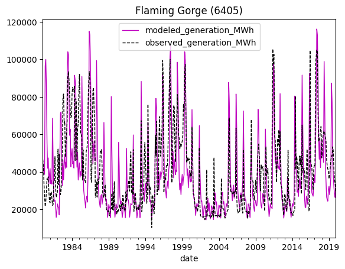

# wmpy-power

`wmpy-power` is a hydropower simulation model developed to support long-term planning and climate impacts studies. It simulates hydropower production at the facility-scale using simulations of managed streamflow and reservoir storage to account for the “non-stationarity” in hydropower generation to changes in hydrology, and the non-linearity in the effect that climate change has on water management. Alternative approaches for estimating hydropower use statistical methods that relate runoff directly to hydropower generation and potentially miss the complex interactions arising from human water management, and hydropower production as water availability changes.

`wmpy-power` is a process-based model that incorporates hydropower facility characteristics and timeseries of streamflow and reservoir storage, and balances the need for an explicit representation of physical processes at the facility scale with a need to work with scarce data and handle biases in the data. The model is designed to simulate an entire region of hydropower facilities in bulk, where the details required to simulate each facility are incomplete. The model also accounts for biases in the input timeseries given that it was designed to work with simulations of streamflow and reservoir storage. `wmpy-power` is unique as a hydropower simulation model in that it explicitly simulates individual facilities using a process-based approach, with less of a data requirement than other process-based models. The tradeoff is a decrease in accuracy at the facility scale, but the model is suitable for the regional scale to support long-term planning.


## Getting Started

`wmpy-power` supports Python versions 3.9 through 3.11. Use of a [virtual environment](https://docs.python.org/3/library/venv.html) is recommended for isolating dependencies.

Install with `pip`:

```shell
pip install wmpy-power
```

Or, clone the repository and install from source (run from repository root):

```shell
pip install -e .
```

Download sample data:

```python
from wmpy_power.utilities import download_data

download_data(data='tutorial', to='./input/')
```

The main functionality of `wmpy-power` is to estimate hydropower for plants within a region using a two step process.

First, calibrate a set of parameters with a two-stage optimization process (described below) using simple plant parameters and observed flow and reservoir storage.

```python
from wmpy_power import Model

# set up the model
model = Model(
	# first year of observations
	calibration_start_year = 2001,
	# last year of observation
	calibration_end_year = 2013,
	# regional grouping, could be balancing authority, HUC4 basin, etc
	balancing_authority = 'WAUW',
	# paths to input files; these can point to a single file or glob to many files (described below)
	simulated_flow_and_storage_glob = '/path/to/plant_flow_and_storage.parquet',
	observed_hydropower_glob = '/path/to/plant_observed_hydropower.parquet',
	reservoir_parameter_glob = '/path/to/plant_parameters.parquet',
	# path to write output files
	output_path = '/path/to/output/directory', 
)

# run the calibration
calibrated_parameters = model.run()

# (optional) view plots for modeled vs observed hydropower for each plant within the region
m.plot(calibrated_parameters)
```

Second, use the calibrated parameters to forecast hydropower based on simulated flow and reservoir storage.

```python
forecasted_generation = model.get_generation(
	calibration_parameters_path = '/path/to/output/directory/WAUW_plant_calibrations.parquet',
	reservoir_parameters_path = '/path/to/plant_parameters.parquet',
	flow_and_storage_path = '/path/to/plant_flow_and_storage.parquet',
	run_name = 'wmpy-power_tutorial',
	start_year = 2020,
	end_year = 2025,
	output_path = '/path/to/output/directory',
)
```

This creates a dataframe of monthly plant level hydropower generation forecasts for each plant in the region!

Note that `wmpy-power` is designed to optimize regional hydropower as opposed to individual plants, so there will likely be discrepancy at the plant level. Depending on the use case it may be advisable sum the modeled hydropower over the region. Sample calibration output of modeled versus observed hydropower at the plant level:




The [tutorial.ipynb](notebooks/tutorial.ipynb) file provides a Jupyter notebook illustration of running the model and plotting results.


## Functionality

#### Introduction
`wmpy-power` simulates hydropower generation using a physically-based representation
of hydropower generation ([Zhou et al., 2018](https://doi.org/10.1088/1748-9326/aad19f)).
Hydropower generation is simulated using timeseries of inflow and storage, and plant
characteristics including nameplate capacity, average head, and reservoir storage capacity (where applicable). Model parameters are calibrated to a reference monthly hydropower
generation dataset - typically historical generation - using the shuffle complex
evolution algorithm (SCE; [Duan et al., 1993](https://doi.org/10.1007/BF00939380)).
A two-stage calibration is performed: first at the balancing authority (BA) scale, and
second at the facility scale.

The model is designed to work with inflow and storage simulated by the `mosartwmpy`
routing and water management model ([Thurber et al., 2021](https://doi.org/10.21105/joss.03221)),
however is agnostic to the source of these data.

#### Calculations
`wmpy-power` uses a simple hydropower generation formula to calculate hydropower generation:

$$ P=\rho ghQ \eta \ (1) $$

|     Variable    |     Variable in Code                                   |     Definition                           |     Units     |     Value                         |
|-----------------|--------------------------------------------------------|------------------------------------------|---------------|-----------------------------------|
|     ρ           |     lumped in with gravitational acceleration; 9800    |     density of water                     |     kg m-3    |     1000                          |
|     g           |     lumped in with density of water; 9800              |     gravitational acceleration           |     m3s-2     |     9.81                          |
|     h           |     plant\_head\_m                                       |     gross hydraulic head of the hydropower facility            |     m         |     plant-specific                |
|     Q           |     flow                                               |     turbine flow rate                    |     m3s-1     |     plant-specific timeseries     |
|     η           |     not directly used; see below                       |     non-dimensional efficiency   term    |     –         |     plant-specific                |

This general formulation (equation 1) is modified for use in the model to accommodate parameters being calibrated, and to accommodate two cases of hydropower generation, run-of-river (ROR) plants, and plants associated with reservoirs. For both cases of generation, the non-dimensional efficiency term (η) is replaced with a combined efficiency and bias correction factor f<sub>b</sub>:

$$ P=\rho ghQf_b \ (2) $$

| Variable | Variable in Code  | Definition                                                   | Units | Value                                                   | Range    |
|----------|-------------------|--------------------------------------------------------------|-------|---------------------------------------------------------|----------|
| fb       | efficiency\_spill | non-dimensional efficiency term and bias correction factor | –     | balancing authority-specific; calibrated in step one  | 0.5-1.5  |


This efficiency term is calibrated at the BA level in step one of the calibration. NOTE: alternative groupings of plants can be used in place of BAs; the BA variable is used by the code, but values can be replaced with other grouping identifiers, for example HUC4 basins.

Q is adjusted to account for both plant-specific maximum flow limits and spill. Maximum flow limits are imposed by limiting Q to a maximum value using Q<sub>max</sub> where:

$$ Q_{max} =Sf_p / \rho gh \ (3) $$

$$ Q =min(Q, Q_{max}) \ (4) $$


|     Variable    |     Variable in Code                     |     Definition                        |     Units     |     Value                                       |     Range      |
|-----------------|------------------------------------------|---------------------------------------|---------------|-------------------------------------------------|----------------|
|     Qmax        |     max\_discharge                       |     density of water                  |     kg m-3    |     1000                                        |                |
|     S           |     nameplate\_capacity\_MW              |     nameplate capacity                |     W         |     plant-specific; from PLEXOS                 |                |
| fp       | penstock\_flexibility | penstock flexibility of handling   max flow | –     | plant-specific; calibrated in step   two | 0.5-1.5 |
|     g           |                                          |     gravitational acceleration        |     m3s-2     |     9.81                                        |                |
|     h           |     head                                 |     hydraulic head of the dam         |     m         |     plant-specific                              |                |

Q is adjusted for spill by month using plant-specific monthly spill correction factors developed in step two of the calibration. These spill correction factors are applied as:

$$ Q_sc,m =Q_m(1 -f_s,m); m = {1,2, ..., 12} \ (5) $$

| Variable | Variable in Code      | Definition                                  | Units | Value                                    | Range   |
|----------|-----------------------|---------------------------------------------|-------|------------------------------------------|---------|
| fs,m     | monthly\_spill        | monthly spill correction factors            | –     | plant-specific; calibrated in step   two | 0-1     |

##### Run-of-River (ROR) Facilities
Generation for ROR plants is calculated using the hydropower generation formula and setting the head (h) to a fixed value equal to the dam height.

##### Reservoir Facilities
Generation for hydropower plants with reservoirs is calculated using the hydropower generation formula, with the head estimated using simulated volumetric storage, total volumetric capacity, and assuming that the shape of the reservoir is a tetrahedron:

$$ h=H^3\sqrt{\frac{v}{v_{max}}} \ (6) $$

| Variable | Variable in Code      | Definition                    | Units | Value                      |
|----------|-----------------------|-------------------------------|-------|----------------------------|
| h        | height                | hydraulic head of the dam     | m     | plant-specific             |
| H        | plant\_head\_m        | dam height                    | m     | plant-specific             |
| V        | storage               | reservoir storage             | m3    | plant-specific timeseries  |
| Vmax     | storage\_capacity\_m3 | reservoir volumetric capacity | m3    | plant-specific             |

##### Shuffled Complex Evolution (SCE) Implementation
SCE is used to implement a two-step multiscale calibration that produces the inputs required for the hydropower generation formula (equation 2). Step one of the calibration is to address the errors in annual hydro-meteorological biases at the scale of hydrologic regions. The objective function used in step one is to minimizes the mean absolute error between annual observed potential generation and annual simulated potential generation at the BA level:

$$ PG_{BA,sim} =  \sum_{i=1}^n \rho gh_i Q_i f_{p,i} \ (7) $$

$$ PG_{BA,obs} =  TL_{2010} \times 0.04 + \sum_{i=1}^n G_{obs,i} \ (8) $$

$$ MAE_{PG} =  \sum_{i=1}^n \lvert PG_{BA_{sim,i}} - PG_{BA_{obs,i}} \rvert \ (9) $$

Potential generation is computed as:

$$ PG = G + R \ (10) $$

$$ R = 0.04TL \ (11) $$

|     Variable    |     Definition              |     Units    |     Value                                            |
|-----------------|-----------------------------|--------------|------------------------------------------------------|
|     PG          |     potential generation    |     MWh      |     computed at the BA scale                         |
|     G           |     actual generation       |     MWh      |     input at the plant scale                         |
|     R           |     operating reserve       |     MWh      |     calculated as 4% of the TL                       |
|     TL          |     total load              |     MWh      |     mean of annual generation   of years provided    |

The operating reserve percentage is set to as default to 4% of total load in model.py (operating\_reserve\_percent). This can be changed in model configuration.

Step two of the calibration seeks to reflect the complexity in monthly multi-objective reservoir operations and daily generation constraints. It works to improve seasonal variation for each power plant by calibrating a penstock flexibility factor (fp) and monthly spill correction factors (fs,1, fs,2,…, fs,12). The objective function used in step two is to minimize the Kling-Gupta Efficiency between simulated monthly power generation and observed monthly power generation at the plant level:

$$ KGE=1-\sqrt{(r-1)^2 + \left(\frac{sd(G_{sim})}{sd(G_{obs})}\right)^2 + \left(\frac{mean(G_{sim})}{mean(G_{obs})}\right)^2}\ (12) $$
$$ r = cor(G_{sim}, G_{obs}) \ (13) $$


|     Variable    |     Definition                      |     Units    |     Value                          |
|-----------------|-------------------------------------|--------------|------------------------------------|
|     Gsim        |     simulated monthly generation    |     MW       |     computed at the plant scale    |
|     Gobs        |     observed monthly generation     |     MW       |     input at the plant scale       |


##### Model Inputs
Model inputs are specified using parquet files.

| Input                                    |                                            |       Description                                                                                        |     Format      |
|------------------------------------------|--------------------------------------------|----------------------------------------------------------------------------------------------------------|-----------------|
|     daily simulated flow and storage     |     simulated\_flow\_and\_storage\_glob    |     daily simulated flow and storage, typically from a MOSART   simulation, for each hydropower plant    |     .parquet    |
|     observed monthly power generation    |     observed\_hydropower\_glob             |     observed monthly hydropower generation for each hydropower   plant                                   |     .parquet    |
|     reservoir and plant parameters       |     reservoir\_parameter\_glob             |     reservoir and hydropower plant static parameters                                                     |     .parquet    |


Many configuration options are available for running the model. These options can be specified in a configuration yaml
file or passed directly to the model initialization method, or both (the latter takes precedence). Most options have
sensible defaults, but a few are required as discussed below. For the full list of configuration options, see the API section below.


There are two ways to run the model. The simplest is to provide a configuration file and run the model directly:

config.yaml

```yaml
# first year of calibration data
calibration_start_year: 1984
# last year of calibration data
calibration_end_year: 2008
# balancing authority or list of balancing authorities to calibrate
balancing_authority:
  - WAPA
# glob to files with simulated daily flow and storage for plants in the balancing authorities
simulated_flow_and_storage_glob: ./inputs/**/*flow*storage*.parquet
# glob to files with observed monthly hydropower for plants in the balancing authorities
observed_hydropower_glob: ./inputs/**/*monthly*obs*.parquet
# glob to files with reservoir/plant parameters for plants in the balancing authorities
reservoir_parameter_glob: ./inputs/**/*PLEXOS*.parquet
```

```commandline
python wmpy_power/model.py config.yaml
```

Alternatively, the model can be invoked from a python script or console:

```python
from wmpy_power import Model

# you can initialize the model using the configuration file:
model = Model('config.yaml')

# or directly:
model = Model(
  calibration_start_year=1984,
  calibration_end_year=2008,
  balancing_authority=['WAPA'],
  simulated_flow_and_storage_glob='./inputs/**/*daily*flow*storage*.parquet',
  observed_hydropower_glob='./inputs/**/*monthly*obs*.parquet',
  reservoir_parameter_glob='./inputs/**/*PLEXOS*.parquet',
)

# or both (keyword arguments take precedence)
model = Model(
  'config.yaml',
  balancing_authority=['CAISO'],
  output_type='csv',
)

# run the model (this will write the calibrations to file but also return a DataFrame
calibrations = model.run()

# plot each plant's modeled hydropower versus observed hydropower
model.plot(calibrations)

# get modeled generation for the calibrations and write to file
generation = Model.get_generation(
  './**/*_plant_calibrations.csv',
  './inputs/*reservoir_parameter*.parquet',
  './inputs/**/*daily*flow*storage*.parquet',
)
```

By default, the model writes the calibrated parameters to a parquet file per balancing  in the current working
directory, but this behavior can be overridden using the `output_path` and `output_type` configuration options.
So far only "csv" and "parquet" formats are supported.

#### Input Files

Daily flow and storage parquet files are expected to have these columns:

column         | example     | units   |
---------------|-------------|---------|
date           | 1980-01-01  | date    |
eia\_plant\_id | 153         | integer |
flow           | 461.003906  | m^3 / s |
storage        | 1.126790e10 | m^3     |

Monthly observed hydropower parquet files are expected to have these columns:

column           | example   | units   |
-----------------|-----------|---------|
year             | 1980      | integer |
month            | 1         | integer |
eia\_plant\_id   | 153       | integer |
generation_MWh   | 38221.193 | MWh     |

Reservoir/plant parameter parquet files are expected to have these columns:

column                   | example | units   |
-------------------------|---------|---------|
eia\_plant\_id           | 153     | integer |
balancing\_authority     | WAPA    | string  |
name                     | 1980    | integer |
nameplate\_capacity\_MW  | 1       | MW      |
plant\_head\_m           | 5123.3  | m       |
storage\_capacity\_m3    | 1.5e10  | m^3     |
use\_run\_of\_river      | True    | boolean |

#### Working with Parquet files

It's easy to read and write parquet files from pandas, just `pip install pyarrow` or `conda install pyarrow`, then:

```python
import pandas as pd
df = pd.read_parquet('/path/to/parquet/file.parquet')
df['my_new_column'] = 42
df.to_parquet('/path/to/new/parquet/file.parquet')
```

#### Legacy Files
`wmpy-power` was originally developed in MATLAB. The model provides a utility to convert Excel and MATLAB files to parquet files. This functionality can also be used to build inputs in Excel and convert them into parquet.

```python
from wmpy_power import Model

Model.update_legacy_input_files(
  daily_flow_storage_path='/path/to/flow/storage/matlab/file.mat',
  reservoir_parameters_path='/path/to/plexos/parameters/excel/file.xlsx',
  monthly_observed_generation_path='/path/to/observed/generation/excel/file.xlsx',
  daily_start_date='1980-01-01', # for daily flow/storage, since this isn't mentioned in the file itself, have to assume a start date
  monthly_start_date='1980-01-01', # for monthly observed hydro, since this isn't mentioned in the file itself, have to assume a start month
  output_path=None, # defaults to the same place as the input files, but with the .parquet extension
  includes_leap_days=False, # whether or not the daily data includes entries for leap days
)

```


## Testing

`wmpy-power` includes a handful of unit tests to ensure proper behavior of the Shuffled Complex Evolution optimization algorithm and its use in the model. The test suite runs automatically when new commits are pushed to the repository. To run the tests manually, use the provided shell script `./test.sh` or directly run `python -m unittest discover wmpy_power`.


## Contributing

We welcome your feedback! See [CONTRIBUTING.md](CONTRIBUTING.md) for guidelines.


## API

`Model.run()` arguments or `config.yaml` entries; returns calibrated parameters dataframe:

| argument (required in bold) | description | default |
|-----------------------------|-------------|---------|
| configuration\_file | path to a YAML file defining the configuration; but note that method arguments will override values in file | None |
| **calibration\_start\_year** | start year of calibration, inclusive | |
| **calibration\_end\_year** | end year of calibration, inclusive | |
| **balancing\_authority** | balancing authority (or other grouping) | |
| **simulated\_flow\_and\_storage\_glob** | path or glob to parquet files specifying daily flow and storage data by plant; see above for required columns (CSV files may also work) | |
| **observed\_hydropower\_glob** | path or glob to parquet files specifying monthly observed hydropower by plant; see above for required columns  (CSV files may also work) | |
| **reservoir\_parameter\_glob** | path or glob to parquet files specifying plant parameters and grouping; see above for required columns  (CSV files may also work) | |
| output\_path | path to which output files should be written | "." |
| output\_type | format of output files; either "csv" or "parquet" | "parquet" |
| operating\_reserve\_percent | see discussion above | 0.04 |
| lower\_bound\_efficiency | minimum allowed efficiency/bias correction for first stage calibration | 0.9 |
| upper\_bound\_efficiency | maximum allowed efficiency/bias correction for first stage calibration | 2.0 |
| lower\_bound\_percentile\_factor | minimum allowed percentile factor for first stage calibration | 0.2 |
| upper\_bound\_percentile_factor | maximum allowed percentile factor for first stage calibration | 0.8 |
| lower\_bound\_spill | minimum allowed spill factor for second stage calibration | 0.0 |
| upper\_bound\_spill | maximum allowed spill factor for second stage calibration  | 1.0 |
| lower\_bound\_penstock | minimum allowed penstock flexibility factor for second stage calibration | 0.5 |
| upper\_bound\_penstock | maximum allowed penstock flexibility factor for second stage calibration | 1.5 |
| efficiency\_penstock\_flexibility | penstock flexibility factor to assume during first stage calibration | 1.1 |
| efficiency\_spill | spill factor to assume during first stage calibration | 0.0 |
| efficiency\_number\_of_complexes | number of sub-populations to use in the SCE solver during the first stage calibration | 3 |
| efficiency\_maximum\_trials | maximum allowed iterations of the SCE solver during the first stage calibration | 10000 |
| efficiency\_maximum\_evolution_loops | maximum allowed evolution loops of the SCE solver during the first stage calibration | 4 |
| efficiency\_minimum\_change_criteria | terminate the SCE solver early if solution does not improve by this percentage during the first stage calibration | 2.0 |
| efficiency\_minimum\_geometric_range | terminate the SCE solver early if vector length of parameters does not change by this much during the first stage calibration   | 0.001 |
| efficiency\_include\_initial\_point | whether or not to include the initial parameters in the initial population of the SCE solver during the first stage calibration | False |
| efficiency\_alpha | alpha parameter to the SCE solver during the first stage calibration (effects "stiffness" of reflexive population member creation) | 1.0 |
| efficiency\_beta | beta parameter to the SCE solver during the first stage calibration (effects "stiffness" of contractive population member creation) | 0.5 |
| generation\_number\_of\_complexes | number of sub-populations to use in the SCE solver during the second stage calibration | 3 |
| generation\_maximum\_trials | maximum allowed iterations of the SCE solver during the second stage calibration | 5000 |
| generation\_maximum\_evolution\_loops | maximum allowed evolution loops of the SCE solver during the second stage calibration | 4 |
| generation\_minimum\_change\_criteria | terminate the SCE solver early if solution does not improve by this percentage during the second stage calibration | 1.0 |
| generation\_minimum\_geometric\_range | terminate the SCE solver early if vector length of parameters does not change by this much during the second stage calibration | 0.00001 |
| generation\_include\_initial\_point | whether or not to include the initial parameters in the initial population of the SCE solver during the second stage calibration | False |
| generation\_alpha | alpha parameter to the SCE solver during the second stage calibration (effects "stiffness" of reflexive population member creation) | 1.0 |
| generation\_beta | beta parameter to the SCE solver during the second stage calibration (effects "stiffness" of contractive population member creation) | 0.5 |
| seed | initialize the SCE solver's random number generator with a seed (for reproducibility), or None for random | None |
| log\_to\_file | whether or not to create a log file with solver messages | True |
| log\_to\_stdout | whether or not to show solver messages in std out (quite noisy especially for notebook environments) | True |
| parallel\_tasks | how many parallel SCE solvers to allow during the second stage plant calibration (defaults to one per available hyperthread) | cpu_count(logical=False) |

<br/><br/>

`Model.plot()` arguments; returns list of figures

| argument (required in bold) | description | default |
|-----------------------------|-------------|---------|
| **calibrations** | the calibrations dataframe as returned/written by the `run()` method | |
| show_plots | whether or not to try showing each figure (requires matplotlib backend); should be disabled when working in Jupyter environment as Jupyter will show the list of figures by returned by default | True |

<br/><br/>

`Model.get_generation()` arguments (static method); returns generation forecast dataframe

| argument (required in bold) | description | default |
|-----------------------------|-------------|---------|
| **calibration\_parameters\_path** | path to the output csv or parque file of model calibration | |
| **reservoir\_parameters\_path** | path to a CSV or parquet file with plant parameters and grouping | |
| **flow\_and\_storage\_path** | path to a CSV or parquet file with plant daily flow and storage data | |
| **run\_name** | name to prepend to the output file after the grouping name | |
| start_year | first year for which to calculate generation; default is all available | -np.Inf |
| end_year | final year for which to calculate generation; default is all available | np.Inf |
| write_output | whether or not to write the generation to file | True |
| output_csv | whether to write the output file as CSV (otherwise parquet) | True |
| output_path | path to which output files should be written | "." |
| parallel_tasks | how many parallel tasks to allow in generation calculation (defaults to one per available hyperthread) | cpu_count(logical=False) |
